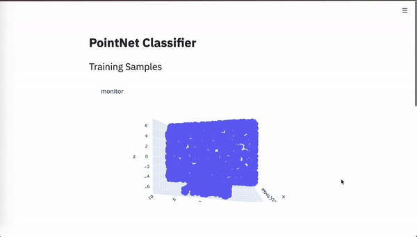

# PointNet

Tensorflow 2.3.0 implementation of the PointNet Architecture for 3D Point Cloud Classification as proposed by the paper [PointNet: Deep Learning on Point Sets for 3D Classification and Segmentation](https://arxiv.org/abs/1612.00593).

## Demo

